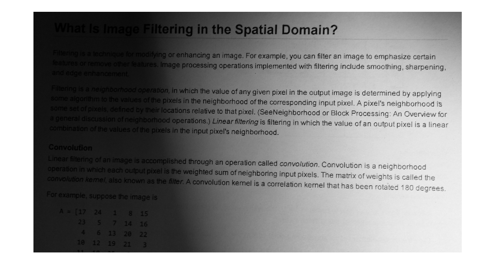
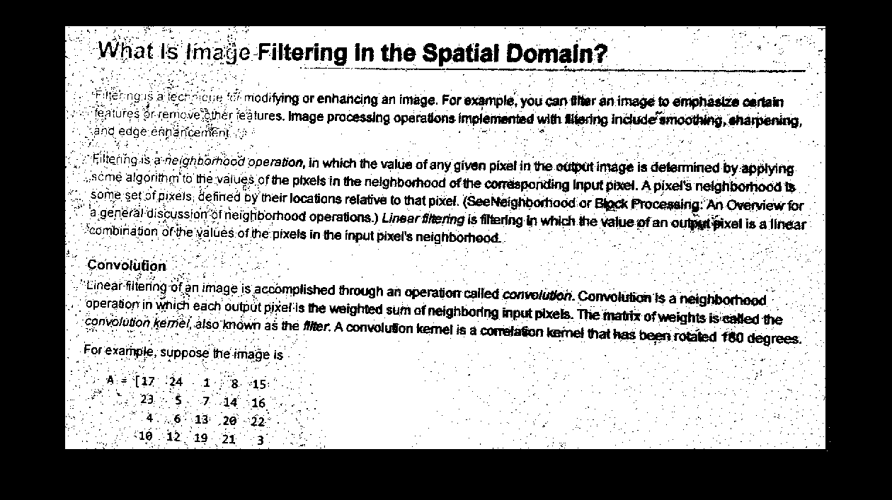

# Image-Processing-projects
* (a)test.py apply Sober filter to image
* (b)test.py apply Guassion filter to image
* (c)test.py apply bilateral filter with different parameters to image
* 1.py perform dilation operation on a map
* 2_test_3.py perform uniform lighting compensation on image 
* text.png original image for lighting compensation
* image_ocompensated_threshold_without_median.png image after lighting compensated

